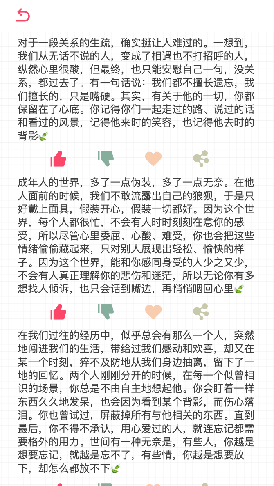

# Vant-App
>一个弄着玩的APP，使用Vue全家桶`VueCli3.x+Vant+Vuex+Vue-Router`。

## 功能特色
- Vant 按需加载组件
- Vant 主题个性化定制
- 移动端`vw,rem`适配
- `Vuex,Vue-Router`模块化
- `axios组件http.js`封装


## 功能预览

- 首页


- 有故事的女同学



## 运行项目

```
# 安装依赖
yarn install
# 启动
yarn serve
# 打包
yarn build

```

## `Vant`定制主题

>这里是基于`Babel7`环境

### 步骤一：在`babel.config.js`中
```js
module.exports = {
  presets: ['@vue/cli-plugin-babel/preset'],
  //添加下面代码
  plugins: [
    [
      'import',
      {
        libraryName: 'vant',
        libraryDirectory: 'es',
        style: (name) => `${name}/style/less`,
      },
      'vant',
    ],
  ],
};
```
### 步骤二： 在`main.js`中
```js
import 'vant/lib/index.less';
```

### 步骤三： 在`vue.config.js`中添加
```js
  css: {
    loaderOptions: {
      less: {
        modifyVars: {
          //通过less文件覆盖（文件路径为绝对路径）
          hack: `true; @import "${path.resolve(
            __dirname,
            './src/assets/style/theme.less'
          )}";`
        }
      }
        //其他插件设置....  
      }
    }
```
---
***参考博文***
 
- [vant-ui 如何定制主题](https://blog.csdn.net/baidu_41601048/article/details/100173818)

### 步骤四：在`assets/style`新建`theme.less`文件

>`theme.less`中定义的变量可参照`vant`插件目录`/node_modules/vant/lib/style/var.less`已经定义的变量，通过在自定义的样式文件`theme.less`定义同名变量进行覆盖`Vant`原来的样式。


## 引入`iconfont`图标（font-class方式）

### 步骤一：以`font-class`方式下载字体图标并解压

>默认文件如下

- demo_index.html
- demo.css
- iconfont.css
- iconfont.eot
- iconfont.js
- iconfont.json
- iconfont.svg
- iconfont.ttf
- iconfont.woff
- iconfont.woff2

其中`demo.xxx`不需要引入，其他文件拷贝至项目制定目录中，比如我这里是放在`assets/font/iconfont`目录下
    
### 在`main.js`导入图标

```js
import './assets/font/iconfont/iconfont.css'
``` 
   
### 在组件中使用

>通常使用在`html`的`<i>`和`<span>`标签中使用

```html
<i class="iconfont icon-account"/>
<span class="iconfont icon-account"/>
```
 
## `Mockjs` 模拟后端接口数据

### 安装`mockjs`

```bash
yarn add mockjs
```

### 使用`mockjs`模拟接口数据

> 在 `mock` 目录下新建 `index.js`文件

```js
import Mock from 'mockjs'; // 引入mockjs
const Random = Mock.Random; // Mock.Random 是一个工具类，用于生成各种随机数据
let data = [];
for (let i = 0; i < 10; i++) {
  // 可自定义生成的个数
  let template = {
    Boolean: Random.boolean, // 可以生成基本数据类型
    Natural: Random.natural(1, 10), // 生成1到100之间自然数
    Integer: Random.integer(1, 100), // 生成1到100之间的整数
    Float: Random.float(0, 100, 0, 5), // 生成0到100之间的浮点数,小数点后尾数为0到5位
    Character: Random.character(), // 生成随机字符串,可加参数定义规则
    String: Random.string(2, 10), // 生成2到10个字符之间的字符串
    Range: Random.range(0, 10, 2), // 生成一个随机数组
    Date: Random.date(), // 生成一个随机日期,可加参数定义日期格式
    Image: Random.image(Random.size, '#02adea', 'Hello'), // Random.size表示将从size数据中任选一个数据
    Color: Random.color(), // 生成一个颜色随机值
    Paragraph: Random.paragraph(2, 5), //生成2至5个句子的文本
    Name: Random.name(), // 生成姓名
    Url: Random.url(), // 生成web地址
    Address: Random.province(), // 生成地址
  };
  data.push(template);
}

Mock.mock('/api/v1/list', 'get', data); // 根据数据模板生成mock常规类型模拟数据
```

### 在`main.js` 中引入

```js
require('@/mock/index');
```

### 在组件中使用接口获取模拟数据

```js
    initMock(){
      this.$axios.get('/api/v1/list', {
        params: {}
      }).then(res => {
        console.log(res);
      }).catch(err => {
      })
    }
```     
    


